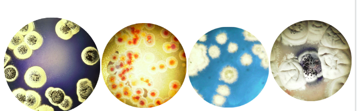
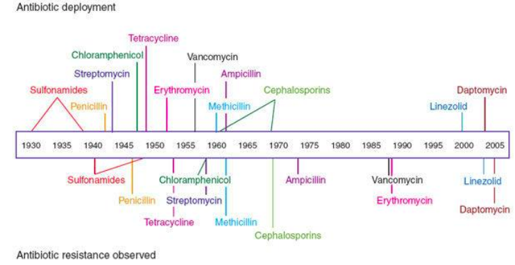

# Sesión 3 Bases de datos, mapas y uso de paquetes de análisis  

## Introducción
Las bases de datos pueden ser públicas o privadas, acumulan información de los organismos y usualmente tienen algún paquete de análisis asociado a ellas. 

### Ejemplo 1 
[Clavigenomics](https://nselem.github.io/clavigenomics/) una base de datos de Clavibacter michiganensis Bacteria patógena de tomate.  

## Otros ejemplos  
### [NCBI](https://www.ncbi.nlm.nih.gov/)  
NCBI es una de las grandes bases de datos biológicas. Hay inormacion de genes, genomas proteinas, etc de muchos organismos.  

Esta secuencia del gen de 16s de _Streptomyces lividans_ proviene de NCBI  
>LC026160.1 Streptomyces lividans gene for 16S ribosomal RNA, partial sequence, strain: AS2
GGGGAGCTCTGCAGTCGACGATGACCACTTCGGTGGGGATTAGTGGCGAACGGGTGAGTAACACGTGGGC
AATCTGCCCTGCACTCTGGGACAAGCCCTGGAAACGGGGTCTAATACCGGATACTGACCCTCGCAGGCAT
CTGCGAGGTTCGAAAGCTCCGGCGGTGCAGGATGAGCCCGCGGCCTATCAGCTTGTTGGTGAGGTAATGG
CTCACCAAGGCGACGACGGGTAGCCGGCCTGAGAGGGCGACCGGCCACACTGGGACTGAGACACGGCCCA
GACTCCTACGGGAGGCAGCAGTGGGGAATATTGCACAATGGGCGAAAGCCTGATGCAGCGACGCCGCGTG
AGGGATGACGGCCTTCGGGTTGTAAACCTCTTTCAGCAGGGAAGAAGCGAAAGTGACGGTACCTGCAGAA
GAAGCGCCGGCTAACTACGTGCCAGCAGCCGCGGTAATACGTAGGGCGCAAGCGTTGTCCGGAATTATTG
GGCGTAAAGAGCTCGTAGGCGGCTTGTCGCGTCGGTTGTGAAAGCCCGGGGCTTAACCCCGGGTCTGCAG
TCGATACGGGCAGGCTAGAGTTCGGTAGGGGAGATCGGAATTCCTGGTGTAGCGGTGAAATGCGCAGATA
TCAGGAGGAACACCGGTGGCGAAGGCGGATCTCTGGGCCGATACTGACGCTGAGGAGCGAAAGCGTGGGG
AGCGAACAGGATTAGATACCCTGGTAGTCCACGCCGTAAACGGTGGGCACTAGGTGTGGGCAACATTCCA
CGTTGTCCGTGCCGCAGCTAACGCATTAAGTGCCCCGCCTGGGGAGTACGGCCGCAAGGCTAAAACTCAA
AGGAATTGACGGGGGCCCGCACAAGCGGCGGAGCATGTGGCTTAATTCGACGCAACGCGAAGAACCTTAC
CAAGGCTTGACATACACCGGAAAGCATCAGAGATGGTGCCCCCCTTGTGGTCGGTGTACAGGTGGTGCAT
GGCTGTCGTCAACTCGTGTCGTGAGATGTTGGGTTAAGTCCCGCAACGAGCGCAACCCTTGTCCCGTGGT
GGCCACCAGGCCCTTGGGGTGCTGGGGAACTCACGGGAAAACCGCCGGGGTCAAATCCGAAGGAAAGTGG
GGGACGACGTCAAAGTCTTCATTGCCCCTTATGGTCTTGGGCTGGCCACCGTGGCTACAAATGGCCCGGT
ACAAATGAACTTGCGATACCCGCCAGGGTGGAAGCGAAACCTCAAAAAGCCCGGTTCCAATTCCNGAATG
GGGGGCTTCGAACCTCACCCCCCTGGAAAGTCCGAGATCCCCTAGGAATCCGGAAATACCCATTTTGCGC
GGGGTAAAACATTTTCCCGCGGCCTTTTTTACACACGCCGCCCTTAAACTCTCAAGAAATTCTTGTACAC
CCCCCAGGAACCGGGTGGCCCCCACCCTCTTTTGGGGGAAGGGACTGTTCCCAAAGGTGGGGTTCCCGGC
ACTGGGGGGGGAATNGTTTTCCTCAAGAAGGTAA

### Blast en NCBI 
Basic Local alignment search tool. Blast es un alineador múltiple de secuencias que al utilizarlo contra la base de datos de NCBI nos ayuda a encontrar otras parecidas.

### Ejercicio 1 Blast en NCBI 
Hagamos blast del 16s de _Streptomyces lividans_ y anota tus observaciones en el [documento colaborativo](https://etherpad.wikimedia.org/p/tsjcimat2022).  
[blastn](https://blast.ncbi.nlm.nih.gov/Blast.cgi?PAGE_TYPE=BlastSearch)  

¿Cómo podrías utilizar blastp? 
[blastp](https://blast.ncbi.nlm.nih.gov/Blast.cgi?PAGE=Proteins)  

  
Descarga el genoma de Streptomyces coelicolor y del organismo que te tocó en el ensamblado de genomas. 
Anota su taxonomía en el documento colaborativo.  

### [RAST](http://rast.nmpdr.org/rast.cgi)  
RAST es un anotador automático. Encuentra genes codificantes y les asigna función.  
Anota en RAST Streptomyces coelicolor y tu organismo ensamblado  
Compáralos  

### [MIBiG](https://mibig.secondarymetabolites.org)    
  
Obten la secuencia de un gen que pertenezca a un cluster de antibióticos y anótala en el documento colaborativo  

### [antiSMASH](https://antismash.secondarymetabolites.org/#!/start)
Anota rápidamente los genomas de Streptomyces y de tu ensamblado. ¿Qué diferencias ves? Anóta tu conclusión en el documento colaborativo.  

### [Kegg](https://www.genome.jp/kegg/),[Brenda](https://www.brenda-enzymes.org/), [pfam](https://pfam.xfam.org/)     
Busca HisA en ambas bases ¿Qué obtienes? 
Toma la secuencia de HisA y analízala en pFAM, qué obtienes? 

¿Cómo son tus organismos en RAST?  
